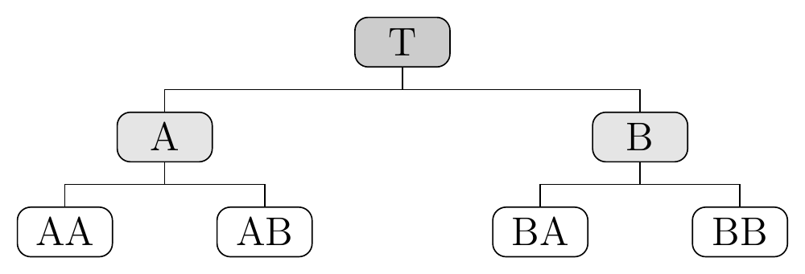
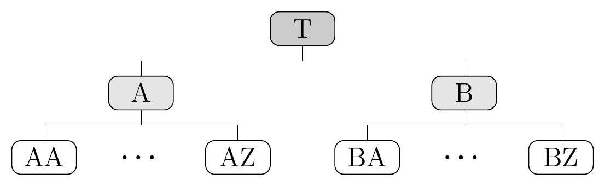

<!-- README.md is generated from README.Rmd. Please edit that file -->

```{r, include = FALSE}
knitr::opts_chunk$set(
  collapse = TRUE,
  comment = "#>",
  fig.path = "man/figures/README-",
  out.width = "75%",
  fig.width = 7,
  fig.height = 4,
  dpi = 150,
  fig.align = "center",
  warning = FALSE,
  message = FALSE
)
```


# bayesRecon: BAyesian reCONciliation of hierarchical forecasts <a href="https://idsia.github.io/bayesRecon/"></a>

<!-- badges: start -->
[](https://github.com/IDSIA/bayesRecon/actions/workflows/R-CMD-check.yaml)
[](https://CRAN.R-project.org/package=bayesRecon)
[](https://cran.r-project.org/package=bayesRecon)
[](https://lifecycle.r-lib.org/articles/stages.html#stable)
[-yellow.svg)](https://www.gnu.org/licences/lgpl-3.0)
[](https://coveralls.io/github/IDSIA/bayesRecon)
<!-- badges: end -->

The package `bayesRecon` implements several methods for probabilistic reconciliation of hierarchical time series forecasts.

The reconciliation functions are:

 * `reconc_gaussian`: reconciliation via conditioning of multivariate Gaussian base forecasts; 
    this is done analytically;
 * `reconc_t`: reconciliation via conditioning of Gaussian forecasts with uncertain covariance matrix; 
    the reconciled forecasts are multivariate Student-t; this is done analytically;
 * `reconc_BUIS`: reconciliation via conditioning of any probabilistic forecast via 
    bottom-up importance sampling;
    an alternative method for discrete forecasts is implemented in `reconc_MCMC`, 
    but we recommend using `reconc_BUIS`;
 * `reconc_MixCond` and `reconc_TDcond`: reconciliation of mixed hierarchies, where 
    the upper forecasts are multivariate Gaussian and the bottom forecasts are 
    discrete distributions; `reconc_MixCond` implements conditioning via importance sampling, 
    while `reconc_TDcond` implements top-down conditioning.
 
## News
:boom: [2026-03-05] bayesRecon v1.0: major update to the API, added `reconc_t`. 

:boom: [2024-05-29] Added `reconc_MixCond` and `reconc_TDcond` and the vignette "Reconciliation of M5 hierarchy with mixed-type forecasts". 

:boom: [2023-12-19] Added the vignette "Properties of the reconciled distribution via conditioning".

:boom: [2023-08-23] Added the vignette "Probabilistic Reconciliation via Conditioning with bayesRecon". Added the `schaferStrimmer_cov` function.

:boom: [2023-05-26] bayesRecon v0.1.0 is released!
 
## Installation

You can install the **stable** version on [R
CRAN](https://cran.r-project.org/package=bayesRecon)

``` r
install.packages("bayesRecon", dependencies = TRUE)
```

You can also install the **development** version from
[Github](https://github.com/IDSIA/bayesRecon)

``` r
# install.packages("devtools")
devtools::install_github("IDSIA/bayesRecon", build_vignettes = TRUE, dependencies = TRUE)
```


## Usage

The package `bayesRecon` implements functions for probabilistic forecast reconciliation.
In the following examples, we show how to use the main reconciliation functions 
of the package for different types of base forecasts.

In each example, we

1. generate simulated hierarchical time series;
2. compute the base forecasts for each series;
3. reconcile the forecasts using the functions from the `bayesRecon` package.


### Example 1: Gaussian forecast distributions

```{r echo=FALSE, out.width='50%', fig.align='center'}

```

<br />

Let us consider a hierarchy with 4 bottom time series and 3 upper time series, as shown in the figure above.
The hierarchy is specified by the *aggregation matrix* **A**:

```{r}
A <- matrix(c(
  1, 1, 1, 1,
  1, 1, 0, 0,
  0, 0, 1, 1
), nrow = 3, byrow = TRUE)
```

In this example, we assume that the base forecasts are multivariate Gaussian, 
which is a common choice for real-valued time series.

To generate the hierarchical time series, we first randomly simulate the bottom series 
using an AR(1) process and then aggregate them using **A** to obtain the upper series.

```{r}
set.seed(1234)

# Simulate bottom series from AR(1) processes
n_obs <- 12  # length of the time series
B_ts <- matrix(nrow = 4, ncol = n_obs)
for (j in 1:4) {
  B_ts[j, ] <- arima.sim(model = list(ar = 0.8), n = n_obs)
}
# Aggregate to obtain upper series 
U_ts <- A %*% B_ts
# Convert to mts
B_ts <- ts(t(B_ts))
U_ts <- ts(t(U_ts))
Y_ts <- cbind(U_ts, B_ts)
```

We compute the base forecasts using an ETS model with Gaussian predictive distribution,
implemented in the [`forecast`](https://cran.r-project.org/package=forecast) package.
For simplicity, we only compute one-step-ahead forecasts, but the same procedure 
can be applied to multi-step-ahead forecasts.

We also save the in-sample residuals of the fitted models, as we later need them 
to estimate the covariance matrix of the base forecasts.

```{r}
library(forecast)

base_fc_mean <- c()
residuals <- matrix(nrow = n_obs, ncol = ncol(Y_ts))
for (j in 1:ncol(Y_ts)) {
  fit <- forecast::ets(Y_ts[,j], additive.only = TRUE)  # fit ets on each time series
  base_fc_mean[j] <- as.numeric(forecast::forecast(fit, h = 1)$mean)
  residuals[,j] <- fit$residuals
}
```

We then analytically compute the reconciled forecasts via conditioning using the 
`reconc_gaussian` and the `reconc_t` functions.
The reconciled forecasts produced by `reconc_gaussian` are multivariate Gaussian,
and they are equivalent to MinT reconciliation ([Zambon et al. 2024](https://doi.org/10.1016/j.ijforecast.2023.12.004)).
The `reconc_t` method adopts a Bayesian approach to account for the uncertainty 
of the covariance matrix of the base forecasts;
the reconciled forecasts, which are multivariate Student-t, 
are typically better calibrated (see [Carrara et al. 2025](https://arxiv.org/abs/2506.19554) for details).

```{r}
library(bayesRecon)

# Reconcile with both methods
rec_g <- reconc_gaussian(
  A,
  base_fc_mean,
  residuals = residuals,
  return_upper = TRUE
)
rec_t <- reconc_t(
  A,
  base_fc_mean,
  y_train = Y_ts,
  residuals = residuals,
  return_upper = TRUE
)

# Compare means of the base and reconciled forecasts
means <- rbind(c(base_fc_mean),
               c(rec_g$upper_rec_mean, rec_g$bottom_rec_mean),
               c(rec_t$upper_rec_mean, rec_t$bottom_rec_mean))
rownames(means) <- c("base", "reconc_gaussian", "reconc_t")
colnames(means) <- c("T", "A", "B", "AA", "AB", "BA", "BB")
print(round(means, 2))
```

Finally, we compare the reconciled forecast distributions for the top series T 
obtained with the two methods by plotting their marginal densities.

```{r, echo = FALSE}
library(ggplot2)

# Index of the series to plot 
i <- 1
# Gaussian reconciled: marginal is Gaussian
mu_g <- rec_g$upper_rec_mean[i]
sd_g <- sqrt(rec_g$upper_rec_cov[i, i])
# t reconciled: marginal is t
mu_t    <- rec_t$upper_rec_mean[i]
scale_t <- sqrt(rec_t$upper_rec_scale_matrix[i, i])
df_t    <- rec_t$upper_rec_df
# x range covering both distributions at the 0.1%-99.9% level
x_lo <- min(qnorm(0.001, mu_g, sd_g), mu_t + qt(0.001, df_t) * scale_t)
x_hi <- max(qnorm(0.999, mu_g, sd_g), mu_t + qt(0.999, df_t) * scale_t)
x_seq <- seq(x_lo, x_hi, length.out = 500)

# Densities of the two reconciled forecasts
df_ex2 <- data.frame(
  x    = rep(x_seq, 2),
  dens = c(
    dnorm(x_seq, mean = mu_g, sd = sd_g),
    dt((x_seq - mu_t) / scale_t, df = df_t) / scale_t
  ),
  type = rep(c("Gaussian reconciled", "t reconciled"), each = length(x_seq))
)

# Plot the densities
ggplot(df_ex2, aes(x = x, y = dens, color = type, linetype = type)) +
  geom_line(linewidth = 1.3) +
  scale_color_manual(values = c("Gaussian reconciled" = "#619CFF", "t reconciled" = "#F8766D")) +
  geom_area(data = subset(df_ex2, type == "Gaussian reconciled"), fill = "#619CFF", alpha = 0.3) +
  geom_area(data = subset(df_ex2, type == "t reconciled"), fill = "#F8766D", alpha = 0.3) +
  labs(
    title = "Reconciled forecast distributions for time series T",
    x = "Value", y = "Density", color = NULL, linetype = NULL
  ) +
  theme_minimal() +
  theme(
    plot.title  = element_text(face = "bold"),
    legend.text = element_text(size = 11)
  )
```


### Example 2: discrete forecast distributions

We consider the same hierarchy of Example 1;
however, we assume that the base forecasts are Poisson distributions, 
which is a common choice for count time series.

We randomly generate the bottom series using Poisson distributions with time-varying 
rates that include a monthly seasonal pattern; we then aggregate them using **A** 
to obtain the upper series.

```{r}
set.seed(123)
n_obs <- 60

# Bottom time series are obtained by drawing from Poisson distributions with time-varying rates
lambda_bls <- c(3, 4, 5, 6)  # baseline Poisson rates for bottom series
seas <- 1.5*sin(2*pi*(1:n_obs)/12)  # specify monthly seasonality (period = 12) 
lambdas <- outer(lambda_bls, seas, FUN = "+")  # adds seasonality to each baseline (4 x n_obs matrix)
lambdas <- lambdas + matrix(rnorm(4 * n_obs, sd = 0.1), nrow = 4) # add small Gaussian noise to rates

# Simulate bottom-level count time series
B_ts <- matrix(rpois(4 * n_obs, lambdas), nrow = 4)
# Aggregate to obtain upper series
U_ts <- A %*% B_ts
# Convert to mts
B_ts <- ts(t(B_ts), frequency = 12)
U_ts <- ts(t(U_ts), frequency = 12)
Y_ts <- cbind(U_ts, B_ts)
```

We compute the one-step-ahead *base forecasts* using the package [`glarma`](https://cran.r-project.org/package=glarma),
which is specific for count time series.
We forecast using a `glarma` model with Poisson predictive distribution.

```{r}
library(glarma)

base_fc <- list()
for (j in 1:ncol(Y_ts)) {
  yj <- Y_ts[,j]  # time series j
  X <- matrix(c(rep(1, length(yj)), seas), ncol = 2)  # matrix of exogenous regressors
  X_new <- matrix(c(1, 1.5*sin(2*pi*(n_obs + 1)/12)), ncol = 2)  # regressors for the forecast period
  fit <- glarma::glarma(yj, X, type = "Poi")  # fit the model
  # Compute base forecasts, which are Poisson distributions specified by the rate parameter 
  fc_lambda <- glarma::forecast(fit, newdata = X_new, n.ahead = 1)$mu  
  # Save the base forecast parameters in a list of lists, one for each series
  base_fc[[j]] <- list(lambda = fc_lambda)  
}
```

We then compute the reconciled forecasts using the bottom-up importance sampling (BUIS) algorithm 
(see [Zambon et al. 2024](https://doi.org/10.1007/s11222-023-10343-y) for details).
The output of `reconc_BUIS` is a joint sample from the reconciled distribution, 
which can be used to compute any desired summary (e.g. mean, quantiles, etc.).

```{r}
rec_buis <- reconc_BUIS(
  A,
  base_fc,
  in_type = "params",
  distr = "poisson",
  num_samples = 20000
)
samples_buis <- rbind(rec_buis$upper_rec_samples,
                      rec_buis$bottom_rec_samples)
rownames(samples_buis) <- c("T", "A", "B", "AA", "AB", "BA", "BB")

# Compute reconciled means
print(round(rowMeans(samples_buis), 2))

# Compute upper quantiles of the reconciled forecast distributions:
print(apply(samples_buis, 1, quantile, probs = c(0.80, 0.95)))
```

Finally, we compare the base and reconciled forecasts for the top series T by plotting 
the base and reconciled forecast distributions.

```{r, echo = FALSE}
# Index of the series to plot 
i <- 1  # top series T
lambda_i <- base_fc[[i]]$lambda

# x range: cover the bulk of both distributions
x_max <- max(qpois(0.999, lambda_i), quantile(samples_buis[i, ], 0.999))
x_min <- min(qpois(0.001, lambda_i), quantile(samples_buis[i, ], 0.001))
x_range <- x_min:x_max

# Base Poisson PMF
base_pmf <- dpois(x_range, lambda = lambda_i)

# Reconciled empirical PMF from BUIS samples
rec_samples_top <- samples_buis[i, ]
rec_pmf <- sapply(x_range, function(x) mean(rec_samples_top == x))

# Combine into a tidy data frame
df_ex1 <- data.frame(
  x    = rep(x_range, 2),
  prob = c(base_pmf, rec_pmf),
  type = rep(c("Base", "Reconciled"), each = length(x_range))
)

ggplot(df_ex1, aes(x = x, y = prob, fill = type)) +
  geom_col(position = position_dodge(width = 0.8), width = 0.7, alpha = 0.85) +
  scale_fill_manual(
    values = c("Base" = "#619CFF", "Reconciled" = "#c77605")
  ) +
  labs(
    title = "Base vs reconciled forecast distribution for time series T",
    x = "Value", y = "Probability", fill = NULL
  ) +
  theme_minimal() +
  theme(
    plot.title  = element_text(face = "bold"),
    legend.text = element_text(size = 11)
  )
```

Similar results can be obtained with `reconc_MCMC`,
which is a bare-bones implementation of the Metropolis-Hastings algorithm.
However, we recommend using `reconc_BUIS` rather than `reconc_MCMC` for reconciling discrete forecasts.

### Example 3: mixed-type forecast distributions

In many large hierarchies the bottom series are low-count integers (e.g., item-level sales),
while the upper series can be considered as real-valued due to the smoothing effect of aggregation (e.g., total sales).
These hierarchies are often referred to as *mixed*, since forecasts for the bottom series are 
discrete distributions, while forecasts for the upper series are continuous distributions.
The functions `reconc_MixCond` and `reconc_TDcond` handle this mixed case: they take
a list of discrete distributions for the bottom level and a multivariate Gaussian for the upper levels.
These functions implement different methods for reconciling mixed hierarchies;
we recommend using `reconc_MixCond` for moderately sized hierarchies
and `reconc_TDcond` for large hierarchies 
(see [Zambon et al. 2024](https://proceedings.mlr.press/v244/zambon24a.html) for details).

Let us consider a hierarchy with 3 upper series and 52 bottom series arranged in 2 groups of 26:

```{r echo=FALSE, out.width='50%', fig.align='center'}

```

<br />

We randomly generate the bottom count time series as in Ex. 2;
we then aggregate them using **A** to obtain the upper series.

```{r}
set.seed(12)
n_b   <- 52   # number of bottom series 
n_u   <- 3    # number of upper series
n_obs <- 60   # series length

# Build aggregation matrix A for the hierarchy in the figure above
A <- rbind(rep(1, n_b),
           c(rep(1, 26), rep(0, 26)),
           c(rep(0, 26), rep(1, 26)))

# Assume Poisson data generating process + monthly seasonality
lambda_levels <- runif(n_b, min = 0.1, max = 2)
seas <- 1 + .5*sin(2*pi*(1:n_obs)/12)
lambdas <- outer(lambda_levels, seas, FUN = "*")

# Generate bottom series
B_ts <- matrix(rpois(n_obs * n_b, lambdas), nrow = n_b)
# Aggregate to obtain upper series
U_ts <- A %*% B_ts
# Convert to mts
B_ts <- ts(t(B_ts), frequency = 12)
U_ts <- ts(t(U_ts), frequency = 12)
```

We show a comparison of upper and bottom time series.
Even though the bottom series are made of low counts, the upper series can be 
considered as real-valued due to the smoothing effect of aggregation.

```{r, echo = FALSE, fig.height = 5}
# Pick one representative bottom series: AA = first bottom series (B_ts[, 1])
i_b <- 1

df_ts <- data.frame(
  t     = rep(1:n_obs, 2),
  value = c(as.numeric(U_ts[, 1]), as.numeric(B_ts[, i_b])),
  type  = factor(
    rep(c("Upper series T (smooth)", "Bottom series AA (count)"), each = n_obs),
    levels = c("Upper series T (smooth)", "Bottom series AA (count)")   # upper panel first
  )
)

ggplot(df_ts, aes(x = t, y = value, color = type)) +
  geom_line(data = subset(df_ts, type == "Upper series T (smooth)"),
            linewidth = 0.9) +
  geom_step(data = subset(df_ts, type == "Bottom series AA (count)"),
            linewidth = 0.8) +
  scale_color_manual(
    values = c("Upper series T (smooth)" = "#619CFF", "Bottom series AA (count)" = "#F8766D")
  ) +
  facet_wrap(~ type, ncol = 1, scales = "free_y") +
  labs(x = "Time", y = "Value") +
  theme_minimal() +
  theme(
    legend.position  = "none",
    strip.text       = element_text(face = "bold", size = 13)
  )
```

We compute the one-step-ahead base forecasts for each upper series with an additive ETS model,
implemented in the [`forecast`](https://cran.r-project.org/package=forecast) package.
We use the covariance matrix of the in-sample residuals, estimated via shrinkage
using the `schaferStrimmer_cov` function, as the joint forecast covariance of the upper series.

```{r}
mu_u <- numeric(n_u)
residuals_u <- matrix(nrow = n_obs, ncol = n_u)
for (j in seq_len(n_u)) {
  fit <- forecast::ets(ts(U_ts[, j]), additive.only = TRUE)
  mu_u[j] <- as.numeric(forecast::forecast(fit, h = 1)$mean)
  residuals_u[, j] <- fit$residuals
}
# Estimate the covariance matrix via Schafer-Strimmer shrinkage from in-sample residuals
Sigma_u <- bayesRecon::schaferStrimmer_cov(residuals_u)$shrink_cov 
# Save upper base forecasts as a list with mean and covariance
base_fc_upper <- list(mean = mu_u, cov = Sigma_u)  
```

We compute the one-step-ahead *base forecasts* for the bottom series using the 
package [`glarma`](https://cran.r-project.org/package=glarma).
The base forecasts are Poisson distributions.

```{r}
base_fc_bottom <- list()
for (j in seq_len(n_b)) {
  bj <- B_ts[,j]
  X <- matrix(c(rep(1, length(bj)), seas), ncol = 2)  # matrix of exogenous regressors
  X_new <- matrix(c(1, 1 + .5*sin(2*pi*(n_obs + 1)/12)), ncol = 2)  # regressors for the forecast period
  fit <- glarma(bj, X, type = "Poi")
  # Bottom base forecasts are Poisson distributions, specified by the rate parameter 
  fc_lambda <- glarma::forecast(fit, newdata = X_new, n.ahead = 1)$mu
  # Save the parameters of bottom base forecasts in a list of lists, one for each series
  base_fc_bottom[[j]] <- list(lambda = fc_lambda)
}
```

We reconcile using both `reconc_MixCond` (importance-sampling based conditioning) and
`reconc_TDcond` (top-down conditioning). 
These functions implement different methods for reconciling mixed hierarchies,
but they share the same input arguments and output structure.

```{r}
res_mc <- reconc_MixCond(
  A, base_fc_bottom, base_fc_upper,
  bottom_in_type = "params", distr = "poisson",
  num_samples = 2e4, 
  return_type = "pmf"
)

res_td <- reconc_TDcond(
  A, base_fc_bottom, base_fc_upper,
  bottom_in_type = "params", distr = "poisson",
  num_samples = 2e4, 
  return_type = "pmf"
)
```

The joint forecast distribution can be obtained by specifying `return_type = "samples"`.
In this case, since we set `return_type = "pmf"`, the functions return the reconciled marginal
forecast distributions as probability mass functions (PMFs).
From these PMFs, we can compute any desired summary (e.g. mean, quantiles, etc.) using the `PMF` functions.

```{r}
# Compare the upper means of the base and reconciled forecasts
upper_means <- rbind(
  base    = mu_u,
  MixCond = sapply(res_mc$upper_rec_pmf, PMF_get_mean),
  TDcond  = sapply(res_td$upper_rec_pmf, PMF_get_mean)
)
colnames(upper_means) <- c("T", "A", "B")
print(round(upper_means, 2))

# Compare the 95% upper quantiles of the base and reconciled forecast distributions
upper_q <- rbind(
  base    = sapply(mu_u, function(m) qnorm(0.95, mean = m, sd = sqrt(Sigma_u[1,1]))),
  MixCond = sapply(res_mc$upper_rec_pmf, PMF_get_quantile, p = 0.95),
  TDcond  = sapply(res_td$upper_rec_pmf, PMF_get_quantile, p = 0.95)
)
colnames(upper_q) <- c("T", "A", "B")
print(round(upper_q, 2))
```

Finally, we compare the base forecast and the two reconciled forecast distributions for the top series T.
The base distribution is a Gaussian density (line); the reconciled distributions are discrete PMFs (bars).
The black triangle indicates the actual value of T.
We refer to [Zambon et al. 2024](https://proceedings.mlr.press/v244/zambon24a.html)
for a detailed comparison of the two methods for reconciling mixed hierarchies of
different sizes.

```{r, echo = FALSE}
# Index of the series to plot (1 = T, the top series)
i <- 1

# Compute the actual value of T in the forecast period, which we will plot as a reference
# use same data generating process
seas_new <- 1 + .5*sin(2*pi*(n_obs + 1)/12)
lambdas_new <- lambda_levels * seas_new
actual_bottom <- rpois(n_b, lambdas_new)
T_actual <- sum(actual_bottom)  # actual value of T in the forecast period

# Base (Gaussian)
mu_base <- mu_u[i]
sd_base <- sqrt(Sigma_u[i, i])

# Reconciled PMFs 
pmf_mc  <- res_mc$upper_rec_pmf[[i]]
pmf_td  <- res_td$upper_rec_pmf[[i]]

# x range: cover the meaningful support of all three distributions
# use PMF_get_quantile to find the quantiles of the PMFs
x_lo <- max(0L, floor(min(
  qnorm(0.001, mu_base, sd_base),
  PMF_get_quantile(pmf_mc, 0.001),
  PMF_get_quantile(pmf_td, 0.001)
)))
x_hi <- ceiling(max(
  qnorm(0.999, mu_base, sd_base),
  PMF_get_quantile(pmf_mc, 0.999),
  PMF_get_quantile(pmf_td, 0.999)
))
x_int <- x_lo:x_hi  # integer support for the bars

# Helper: read probability at each integer in x from a PMF vector
pmf_vals <- function(pmf, x) {
  # initialize with zeros; then fill in the probabilities for the valid x values
  p <- numeric(length(x))
  ok <- x >= 0L & x < length(pmf)
  p[ok] <- pmf[x[ok] + 1L]
  p
}

# Tidy data frame for the two reconciled PMFs (bars)
df_bars <- data.frame(
  x    = rep(x_int, 2),
  prob = c(pmf_vals(pmf_mc, x_int), pmf_vals(pmf_td, x_int)),
  type = rep(c("MixCond reconciled", "TDcond reconciled"), each = length(x_int))
)

# Tidy data frame for the Gaussian base density (line)
x_cont <- seq(x_lo, x_hi, length.out = 600)
df_line <- data.frame(
  x    = x_cont,
  dens = dnorm(x_cont, mean = mu_base, sd = sd_base),
  type = "Base (Gaussian)"
)

ggplot() +
  geom_col(
    data = df_bars,
    aes(x = x, y = prob, fill = type),
    position = position_dodge(width = 0.8), width = 0.7, alpha = 0.85
  ) +
  geom_line(
    data = df_line,
    aes(x = x, y = dens, color = "Base (Gaussian)"),
    linetype = "solid", linewidth = 1.3
  ) +
  geom_point(
    data = data.frame(x = T_actual, y = 0),
    aes(x = x, y = y, color = "Actual value"),
    shape = 17, size = 4
  ) +
  scale_fill_manual(
    values = c("MixCond reconciled" = "#F8766D", "TDcond reconciled" = "#00BA38"),
    name = NULL
  ) +
  scale_color_manual(
    values = c("Actual value" = "black", "Base (Gaussian)" = "#619CFF"),
    name = NULL
  ) +
  guides(
    color = guide_legend(
      override.aes = list(
        shape     = c(17, NA),
        linetype  = c("blank", "solid"),
        linewidth = c(0, 1.3)
      )
    )
  ) +
  labs(
    title = "Base vs reconciled forecast distributions for time series T",
    x = "Value", y = "Probability / Density"
  ) +
  theme_minimal() +
  theme(
    plot.title  = element_text(face = "bold"),
    legend.text = element_text(size = 11),
    legend.spacing.y = unit(-0.3, 'cm')
  )
```

## References

Carrara, C., Corani, G., Azzimonti, D., Zambon, L. (2025). 
*Modeling the uncertainty on the covariance matrix for probabilistic forecast reconciliation*. arXiv preprint arXiv:2506.19554.
[Available here](https://arxiv.org/abs/2506.19554)

Corani, G., Azzimonti, D., Augusto, J.P.S.C., Zaffalon, M. (2021). 
*Probabilistic Reconciliation of Hierarchical Forecast via Bayes’ Rule*. 
ECML PKDD 2020. Lecture Notes in Computer Science, vol 12459.
[DOI](https://doi.org/10.1007/978-3-030-67664-3_13)

Corani, G., Azzimonti, D., Rubattu, N. (2024). 
*Probabilistic reconciliation of count time series*. 
International Journal of Forecasting 40 (2), 457-469.
[DOI](https://doi.org/10.1016/j.ijforecast.2023.04.003)

Zambon, L., Azzimonti, D. & Corani, G. (2024). 
*Efficient probabilistic reconciliation of forecasts for real-valued and count time series*.
Statistics and Computing 34 (1), 21.
[DOI](https://doi.org/10.1007/s11222-023-10343-y)

Zambon, L., Agosto, A., Giudici, P., Corani, G. (2024). 
*Properties of the reconciled distributions for Gaussian and count forecasts*.
International Journal of Forecasting 40 (4), 1438-1448.
[DOI](https://doi.org/10.1016/j.ijforecast.2023.12.004)

Zambon, L., Azzimonti, D., Rubattu, N., Corani, G. (2024).
*Probabilistic reconciliation of mixed-type hierarchical time series*.
Proceedings of the Fortieth Conference on Uncertainty in Artificial Intelligence,
in Proceedings of Machine Learning Research 244:4078-4095. [Available here](https://proceedings.mlr.press/v244/zambon24a.html).

## Contributors

<!-- prettier-ignore-start -->
<!-- markdownlint-disable -->
<table>
  <tbody>
    <tr>
      <td align="center" valign="top" width="14.28%">
        <a href="https://sites.google.com/view/darioazzimonti/home">
        <br />
        <sub><b>Dario Azzimonti</b></sub></a><br />
        <sub>(Maintainer)</sub><br />
        <a href="mailto:dario.azzimonti@gmail.com?subject=[bayesRecon package]">Email</a>
      </td>
      <td align="center" valign="top" width="14.28%">
        <a href="#">
        <br />
        <sub><b>Lorenzo Zambon</b></sub></a><br />
        <sub>&nbsp;</sub><br />
        <a href="mailto:lorenzo.zambon@idsia.ch?subject=[bayesRecon package]">Email</a>
      </td>
      <td align="center" valign="top" width="14.28%">
        <a href="#">
        <br />
        <sub><b>Stefano Damato</b></sub></a><br />
        <sub>&nbsp;</sub><br />
        <a href="mailto:stefano.damato@idsia.ch?subject=[bayesRecon package]">Email</a>
      </td>
      <td align="center" valign="top" width="14.28%">
        <a href="#">
        <br />
        <sub><b>Nicolò Rubattu</b></sub></a><br />
        <sub>&nbsp;</sub><br />
        <a href="mailto:nico.rubattu@gmail.com?subject=[bayesRecon package]">Email</a>
      </td>
      <td align="center" valign="top" width="14.28%">
        <a href="https://sites.google.com/site/awerbhjkl678214/home">
        <br />
        <sub><b>Giorgio Corani</b></sub></a><br />
        <sub>&nbsp;</sub><br />
        <a href="mailto:giorgio.corani@idsia.ch?subject=[bayesRecon package]">Email</a>
      </td>
      </tr>
  </tbody>
</table>

<!-- markdownlint-restore -->
<!-- prettier-ignore-end -->

## Getting help

If you encounter a clear bug, please file a minimal reproducible example
on [GitHub](https://github.com/IDSIA/bayesRecon/issues).


