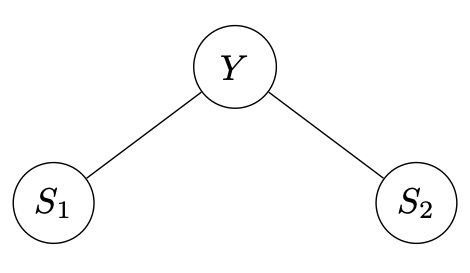
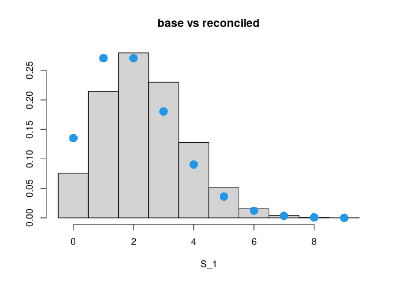
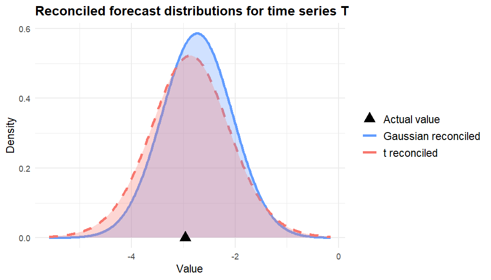

<!-- README.md is generated from README.Rmd. Please edit that file -->

# bayesRecon: BAyesian reCONciliation of hierarchical forecasts

<!-- 

-->
<!-- badges: start -->

[](https://github.com/IDSIA/bayesRecon/actions/workflows/R-CMD-check.yaml)
[](https://CRAN.R-project.org/package=bayesRecon)
[](https://cran.r-project.org/package=bayesRecon)
[](https://lifecycle.r-lib.org/articles/stages.html#experimental)
[-yellow.svg)](https://www.gnu.org/licences/lgpl-3.0)
<!-- badges: end -->

The package `bayesRecon` implements probabilistic reconciliation of
hierarchical time series forecasts via conditioning.

The main functions are:

- `reconc_gaussian`: implements analytic formulae for the reconciliation
  of Gaussian base forecasts;
- `reconc_BUIS`: a generic tool for the reconciliation of any
  probabilistic time series forecast via importance sampling; this is
  the recommended option for non-Gaussian base forecasts;
- `reconc_MCMC`: a generic tool for the reconciliation of probabilistic
  count time series forecasts via Markov Chain Monte Carlo.

## News

:boom: \[2023-08-23\] Added the vignette “Probabilistic Reconciliation
via Conditioning with bayesRecon”. Added the `schaferStrimmer_cov`
function.

:boom: \[2023-05-26\] bayesRecon v0.1.0 is released!

## Installation

You can install the **stable** version on [R
CRAN](https://cran.r-project.org/package=bayesRecon)

``` r
install.packages("bayesRecon", dependencies = TRUE)
```

You can also install the **development** version from
[Github](https://github.com/IDSIA/bayesRecon)

``` r
# install.packages("devtools")
devtools::install_github("IDSIA/bayesRecon", build_vignettes = TRUE, dependencies = TRUE)
```

## Usage

Let us consider the minimal temporal hierarchy in the figure, where the
bottom variables are the two 6-monthly forecasts and the upper variable
is the yearly forecast. We denote the variables for the two semesters
and the year by $S_1, S_2, Y$ respectively.



The hierarchy is described by the *aggregating matrix* S, which can be
obtained using the function `get_reconc_matrices`.

``` r
library(bayesRecon)

rec_mat <- get_reconc_matrices(agg_levels = c(1, 2), h = 2)
S <- rec_mat$S
print(S)
#>      [,1] [,2]
#> [1,]    1    1
#> [2,]    1    0
#> [3,]    0    1
```

### Example 1: Poisson base forecasts

We assume that the base forecasts are Poisson distributed, with
parameters given by $\lambda_{Y} = 9$, $\lambda_{S_1} = 2$, and
$\lambda_{S_2} = 4$.

``` r
lambdaS1 <- 2
lambdaS2 <- 4
lambdaY <- 9
lambdas <- c(lambdaY, lambdaS1, lambdaS2)

base_forecasts = list()
for (i in 1:nrow(S)) {
  base_forecasts[[i]] = lambdas[i]
}
```

We recommend using the BUIS algorithm (Zambon et al., 2022) to sample
from the reconciled distribution.

``` r
buis <- reconc_BUIS(
  S,
  base_forecasts,
  in_type = "params",
  distr = "poisson",
  num_samples = 100000,
  seed = 42
)

samples_buis <- buis$reconciled_samples
```

Since there is a positive incoherence in the forecasts
($\lambda_Y > \lambda_{S_1}+\lambda_{S_2}$), the mean of the bottom
reconciled forecast increases. We show below this behavior for $S_1$.

``` r
reconciled_forecast_S1 <- buis$bottom_reconciled_samples[1,]
range_forecats <- range(reconciled_forecast_S1)
hist(
  reconciled_forecast_S1,
  breaks = seq(range_forecats[1] - 0.5, range_forecats[2] + 0.5),
  freq = F,
  xlab = "S_1",
  ylab = NULL,
  main = "base vs reconciled"
)
points(
  seq(range_forecats[1], range_forecats[2]),
  stats::dpois(seq(range_forecats[1], range_forecats[2]), lambda =
                 lambdaS1),
  pch = 16,
  col = 4,
  cex = 2
)
```



The blue circles represent the probability mass function of a Poisson
with parameter $\lambda_{S_1}$ plotted on top of the histogram of the
reconciled bottom forecasts for $S_1$. Note how the histogram is shifted
to the right.

Moreover, while the base bottom forecast were assumed independent, the
operation of reconciliation introduced a negative correlation between
$S_1$ and $S_2$. We can visualize it with the plot below which shows the
empirical correlations between the reconciled samples of $S_1$ and the
reconciled samples of $S_2$.

``` r
AA <-
  xyTable(buis$bottom_reconciled_samples[1, ],
          buis$bottom_reconciled_samples[2, ])
plot(
  AA$x ,
  AA$y ,
  cex = AA$number * 0.001  ,
  pch = 16 ,
  col = rgb(0, 0, 1, 0.4) ,
  xlab = "S_1" ,
  ylab = "S_2" ,
  xlim = range(buis$bottom_reconciled_samples[1, ]) ,
  ylim = range(buis$bottom_reconciled_samples[2, ])
)
```



We also provide a function for sampling using Markov Chain Monte Carlo
(Corani et al., 2022).

``` r
mcmc = reconc_MCMC(
  S,
  base_forecasts,
  distr = "poisson",
  num_samples = 30000,
  seed = 42
)

samples_mcmc <- mcmc$reconciled_samples
```

### Example 2: Gaussian base forecasts

We now assume that the base forecasts are Gaussian distributed, with
parameters given by

- $\mu_{Y} = 9$, $\mu_{S_1} = 2$, and $\mu_{S_2} = 4$;
- $\sigma_{Y} = 2$, $\sigma_{S_1} = 2$, and $\sigma_{S_2} = 3$.

``` r
muS1 <- 2
muS2 <- 4
muY <- 9
mus <- c(muY, muS1, muS2)

sigmaS1 <- 2
sigmaS2 <- 2
sigmaY <- 3
sigmas <- c(sigmaY, sigmaS1, sigmaS2)

base_forecasts = list()
for (i in 1:nrow(S)) {
  base_forecasts[[i]] = c(mus[[i]], sigmas[[i]])
}
```

We use the BUIS algorithm to sample from the reconciled distribution:

``` r
buis <- reconc_BUIS(
  S,
  base_forecasts,
  in_type = "params",
  distr = "gaussian",
  num_samples = 100000,
  seed = 42
)
samples_buis <- buis$reconciled_samples
buis_means <- rowMeans(samples_buis)
```

In the base forecasts are Gaussian, the reconciled distribution is still
Gaussian and can be computed in closed form:

``` r
Sigma <- diag(sigmas ^ 2)  #transform into covariance matrix
analytic_rec <- reconc_gaussian(S,
                                base_forecasts.mu = mus,
                                base_forecasts.Sigma = Sigma)
analytic_means <- c(analytic_rec$upper_reconciled_mean,
                    analytic_rec$bottom_reconciled_mean) 
```

The base means of $Y$, $S_1$, and $S_2$ are 9, 2, 4.

The reconciled means obtained analytically are 7.41, 2.71, 4.71, while
the reconciled means obtained via BUIS are 7.41, 2.71, 4.71.

## References

Corani, G., Azzimonti, D., Augusto, J.P.S.C., Zaffalon, M. (2021).
*Probabilistic Reconciliation of Hierarchical Forecast via Bayes’ Rule*.
In: Hutter, F., Kersting, K., Lijffijt, J., Valera, I. (eds) Machine
Learning and Knowledge Discovery in Databases. ECML PKDD 2020. Lecture
Notes in Computer Science(), vol 12459. Springer, Cham.
[DOI](https://doi.org/10.1007/978-3-030-67664-3_13)

Corani, G., Azzimonti, D., Rubattu, N. (2023). *Probabilistic
reconciliation of count time series*.
[DOI](https://doi.org/10.1016/j.ijforecast.2023.04.003)

Zambon, L., Azzimonti, D. & Corani, G. (2022). *Efficient probabilistic
reconciliation of forecasts for real-valued and count time series*.
[DOI](https://doi.org/10.48550/arXiv.2210.02286)

Zambon, L., Agosto, A., Giudici, P., Corani, G. (2023). *Properties of
the reconciled distributions for Gaussian and count forecasts*.
[DOI](https://doi.org/10.48550/arXiv.2303.15135)

## Contributors

<!-- prettier-ignore-start -->
<!-- markdownlint-disable -->
<table>
<tbody>
<tr>
<td align="center" valign="top" width="14.28%">
<a href="https://sites.google.com/view/darioazzimonti/home">
<br />
<sub><b>Dario Azzimonti</b></sub></a><br />
<sub>(Maintainer)</sub><br />
<a href="mailto:dario.azzimonti@gmail.com?subject=bayesRecon package!">dario.azzimonti@gmail.com</a>
</td>
<td align="center" valign="top" width="14.28%">
<a href="#">
<br />
<sub><b>Nicolò Rubattu</b></sub></a><br />
<a href="mailto:nicolo.rubattu@idsia.ch?subject=bayesRecon package!">nicolo.rubattu@idsia.ch</a>
</td>
<td align="center" valign="top" width="14.28%">
<a href="#">
<br />
<sub><b>Lorenzo Zambon</b></sub></a><br />
<a href="mailto:lorenzo.zambon@idsia.ch?subject=bayesRecon package!">lorenzo.zambon@idsia.ch</a>
</td>
<td align="center" valign="top" width="14.28%">
<a href="https://sites.google.com/site/awerbhjkl678214/home">
<br />
<sub><b>Giorgio Corani</b></sub></a><br />
<a href="mailto:giorgio.corani@idsia.ch">giorgio.corani@idsia.ch</a>
</td>
</tr>
</tbody>
</table>
<!-- markdownlint-restore -->
<!-- prettier-ignore-end -->

## Getting help

If you encounter a clear bug, please file a minimal reproducible example
on [GitHub](https://github.com/IDSIA/bayesRecon/issues).
