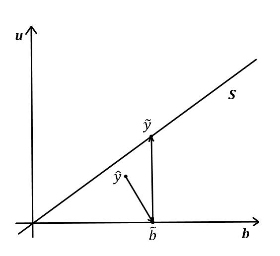
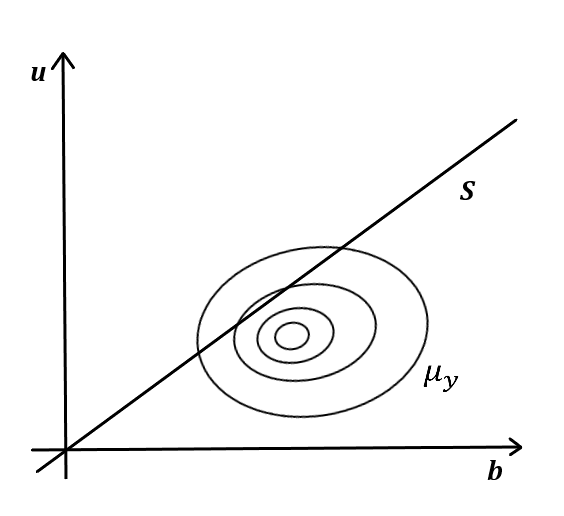
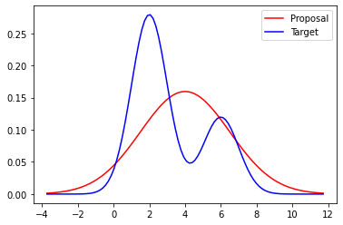

```{r setup, include = FALSE}
knitr::opts_chunk$set(
  collapse = TRUE,
  comment = "#>"
)
set.seed(42)
```

```{r klippy, echo=FALSE, include=TRUE}
klippy::klippy(position = c('top', 'right'), tooltip_message = 'Copy', tooltip_success = 'Done', color="black")
```

# Introduction

This vignette  how to  reconcile hierarchical forecasts using the `bayesRecon` package ([R CRAN](https://cran.r-project.org/package=bayesRecon)). The reconciliation is probabilistic.

Frequently, time series data can be naturally disaggregated. 
For example, 
a hierarchical time series regarding
the  car sold by a dealer  could be obtained  by disaggregating the total sales first by  manufacturer and then by car type  (e.g. City, Compact, Station Wagon, SUV).
Hierarchical time series are often the result of taxonomies and geographic division.

Another type of hierarchical
forecast involves 
temporal hierarchies [@athanasopoulos2017forecasting], 
in which case the same variable is forecast at different time scales.
For example, consider a *monthly* time series. 
We want to predict the next year (i.e., a forecasting horizon *h* = 12).
We  obtain for instance *quarterly* and *yearly* time series by aggregating of monthly values.
Bottom levels are generally noisy, while upper levels are smoother and trends and seasonal patterns are better observable. 
<br><br>

```{r fig1, engine='tikz', fig.cap="**Figure 1**. Example of temporal aggregation of a *monthly* time series.", fig.ext = 'png', fig.align="center", echo=FALSE, out.width="80%"}
\begin{tikzpicture}
  \node[shape=circle,draw=black] (Y) at (7.25,6) {$Y$};
  \node[shape=circle,draw=black] (Q1) at (2,4.5) {$Q_1$};
  \node[shape=circle,draw=black] (Q2) at (5.5,4.5) {$Q_2$};
  \node[shape=circle,draw=black] (Q3) at (9,4.5) {$Q_3$};
  \node[shape=circle,draw=black] (Q4) at (12.6,4.5) {$Q_4$};
  \node[shape=circle,draw=black] (M1) at (1,3) {$M_1$};
  \node[shape=circle,draw=black] (M2) at (2,3) {$M_2$};
  \node[shape=circle,draw=black] (M3) at (3,3) {$M_3$};
  \node[shape=circle,draw=black] (M4) at (4.5,3) {$M_4$};
  \node[shape=circle,draw=black] (M5) at (5.5,3) {$M_5$};
  \node[shape=circle,draw=black] (M6) at (6.5,3) {$M_6$};
  \node[shape=circle,draw=black] (M7) at (8,3) {$M_7$};
  \node[shape=circle,draw=black] (M8) at (9,3) {$M_8$};
  \node[shape=circle,draw=black] (M9) at (10,3) {$M_9$};
  \node[shape=circle,draw=black] (M10) at (11.5,3) {$M_{10}$};
  \node[shape=circle,draw=black] (M11) at (12.6,3) {$M_{11}$};
  \node[shape=circle,draw=black] (M12) at (13.7,3) {$M_{12}$};

  \path [-] (Y) edge node[left] {} (Q1);
  \path [-] (Y) edge node[left] {} (Q2);
  \path [-] (Y) edge node[left] {} (Q3);
  \path [-] (Y) edge node[left] {} (Q4);

  \path [-] (Q1) edge node[left] {} (M1);
  \path [-] (Q1) edge node[left] {} (M2);
  \path [-] (Q1) edge node[left] {} (M3);
  \path [-] (Q2) edge node[left] {} (M4);
  \path [-] (Q2) edge node[left] {} (M5);
  \path [-] (Q2) edge node[left] {} (M6);
  \path [-] (Q3) edge node[left] {} (M7);
  \path [-] (Q3) edge node[left] {} (M8);
  \path [-] (Q3) edge node[left] {} (M9);
  \path [-] (Q4) edge node[left] {} (M10);
  \path [-] (Q4) edge node[left] {} (M11);
  \path [-] (Q4) edge node[left] {} (M12);
\end{tikzpicture}
```

<br>
A temporal hierarchy works as follows. First, *base forecasts* are produced by independent models, each for a certain temporal scales. Since base forecasts do not sum correctly, they are 
referred to as *incoherent*. **Reconciliation** is the process of adjusting the base forecasts
so that they become *coherent*. Reconciliation methods have also been shown to improve the accuracy over base forecasts [@athanasopoulos2017forecasting].

### Notation
**Bottom** observations: 
$$b = \begin{matrix} b_1 & \ldots & b_m \end{matrix}^T \in \mathbb{R}^m $$
**Upper** observations:
$$u = \begin{bmatrix} u_1 & \ldots & u_n \end{bmatrix}^T \in \mathbb{R}^n $$
**Hierarchy**. 
For any aggregation structure, the $n \times m$ matrix $\mathbf{S}$ is referred to as the *summing matrix*.
$$y = \mathbf{S}b,\quad\text{where}\,\,\, y = \begin{bmatrix} u \\ b \end{bmatrix} 
\,\text{and}\,\,\mathbf{S} = \begin{bmatrix} \mathbf{A} \\ \hdashline I_m \end{bmatrix}$$
Example:
<table style="border:1px solid white; width:70%; align=left">
<tr>
<td>
```{r fig2, engine='tikz', fig.cap="**Figure 2**. Example of hierarchy.", fig.ext = 'png', fig.align="center", echo=FALSE, out.width="80%"}
\begin{tikzpicture}
  \node[rounded corners,draw=black] (u1) at (2,2) {$u_1$};
  \node[rounded corners,draw=black] (u2) at (1,1) {$u_2$};
  \node[rounded corners,draw=black] (u3) at (3,1) {$u_3$};
  \node[rounded corners,draw=black] (b1) at (0.5,0) {$b_1$};
  \node[rounded corners,draw=black] (b2) at (1.5,0) {$b_2$};
  \node[rounded corners,draw=black] (b3) at (2.5,0) {$b_3$};
  \node[rounded corners,draw=black] (b4) at (3.5,0) {$b_4$};

  \path [-] (u1) edge node[left] {} (u2);
  \path [-] (u1) edge node[left] {} (u3);
  \path [-] (u2) edge node[left] {} (b1);
  \path [-] (u2) edge node[left] {} (b2);
  \path [-] (u3) edge node[left] {} (b3);
  \path [-] (u3) edge node[left] {} (b4);
\end{tikzpicture}
```
</td>
<td>
$$
\begin{bmatrix} u_1 \\ u_2 \\ u_3 \\ b_1 \\ b_2 \\ b_3 \\ b_4  \end{bmatrix} = 
\begin{bmatrix}
           1 & 1 & 1 & 1 \\
           1 & 1 & 0 & 0 \\
            0 & 0 & 1 & 1 \\ \hdashline
           1 & 0 & 0 & 0 \\
            0 & 1 & 0 & 0 \\
            0 & 0 & 1 & 0 \\
            0 & 0 & 0 & 1 
         \end{bmatrix} 
\begin{bmatrix} b_1 \\ b_2 \\ b_3 \\ b_4  \end{bmatrix}$$
</td>
</tr>
</table>

## Point Reconciliation
We forecasts all the series of the hierarchy and we obtain the *base forecasts*, denoted by $\hat{y}_h$. We denote the *coherent forecasts* by $\tilde{y}_h$. For general linear reconciliation method is the equation:
$$
\tilde{y}_h = \mathbf{S}\overbrace{\mathbf{G}\hat{y}_h}^{\tilde{b_h}}
$$
The reconciliation method determines the definition of the matrix $\mathbf{G}$. <br />
For the Bottom-Up approach; $\mathbf{G} = \begin{bmatrix} 0 \\ \hdashline I_m \end{bmatrix}$. \
For the MinT optimal reconciliation approach [@wickramasuriya2019optimal]: 
$$\mathbf{G} = (\mathbf{S}^T\mathbf{W}^{-1}_h\mathbf{S})^{-1}\mathbf{S}^T\mathbf{W}^{-1}_h$$
where $\mathbf{W}_h = \text{Var}[(y_h - \hat{y}_h)]$.

## Probabilistic Reconciliation
In a probabilistic framework, forecasts (*base distribution*) are assumed to be in the form of a predictive distribution $\pi_y \in \mathcal{P}(\mathbb{R}^{n+m})$, rather then a point forecast.

Let $\mathcal{S} := \{ \mathbf{u} = \mathbf{A}\mathbf{b} \}$ be the the coherent subspace.
The aim of probabilistic reconciliation is is to find a *reconciled distribution* $\tilde{\pi}_y \in \mathcal{P}(\mathcal{S})$. <br><br>
```{r fig3, fig.show = "hold", fig.cap="**Figure 3**: Point reconciliation (left), probabilistic reconciliation (right).", out.width = "40%", fig.align = "center", echo=FALSE}


```

<br>
@panagiotelis2023probabilistic defined the reconciled distribution $\tilde{\pi}_y \in \mathcal{P}(\mathcal{S})$ as $\tilde{\pi}_y = \psi_{\#} \pi_y$, given a map $\psi: \mathbb{R}^{n+m} \to \mathcal{S}$, e.g. $\psi(\hat{y}) = S G \hat{y}$.  \
@rangapuram2021end imposed the coherence during training by $L^2$-projection of samples on $\mathcal{S}$. \
@corani2021probabilistic analitically computed the reconciled distribution in the Gaussian case.

### Reconciliation via conditioning
$$
\tilde{\pi}_B(\mathbf{b}) = Prob\big(\hat{\mathbf{B}} = \mathbf{b} \mid \hat{\mathbf{U}} = \mathbf{A} \hat{\mathbf{B}} \big) \nonumber\\
\propto   Prob(\mathbf{A} \mathbf{b},\mathbf{b})
$$
where $\hat{\mathbf{B}} \sim \hat{\pi}_B$ and $\hat{\mathbf{U}} \sim \hat{\pi}_U$. \
If $\hat{\mathbf{B}}$ and $\hat{\mathbf{U}}$ are conditionally independent: $\tilde{\pi}_B(\mathbf{b}) = \hat{\pi}_B(\mathbf{b})\,\hat{\pi}_U(\mathbf{A}\mathbf{b})$.

If the base forecast is Gaussian, $\hat{\pi}_Y = \mathcal{N}( \mathbf{\hat{y}}, \,\mathbf{\hat{\Sigma}}_Y)$, then the reconciled forecast is also Gaussian: $\tilde{\pi}_B = \mathcal{N}(\tilde{\mathbf{b}}, \,\mathbf{\tilde{\Sigma}}_B)$. $\tilde{\mathbf{b}}$ and $\tilde{\mathbf{\Sigma}}_B$ can be computed analytically [@corani2021probabilistic].

If the base forecast is Non-Gaussian, there is no closed-form expression, indeed we need to sample from the reconciled distribution.

#### How to sample from $\tilde{\pi}_B(\mathbf{b})$ ?

*   Markov Chain Monte Carlo \
`bayesRecon` implements it (bare-bones implementation of the Metropolis-Hastings algorithm) via the function `reconc_MCMC` [@corani2021probabilistic].
*   Importance Sampling \
`bayesRecon` implements the Bottom-Up Importance Sampling (BUIS) algorithm via the function `reconc_BUIS` [@zambon2022probabilistic].

# Bottom-Up Importance Sampling (BUIS)

## Importance Sampling
Given a **target** distribution *q* and a function *g*, we want to compute $\mathbb{E}_{Y \sim q}\left[g(Y)\right]$. \
If I was able to draw $y_1, \dots, y_N \overset{\text{IID}}{\sim} q$ $\, \Longrightarrow \;$
$\mathbb{E}\left[g(Y)\right] \approx \frac{1}{N} \sum_{i=1}^N g(y_i)$.

With IS, we are able to estimate $\mathbb{E}\left[g(Y)\right]$:

<table style="border:1px solid white; width:70%; align=left">
<tr>
<td style="width: 60%;">
```{r fig4, fig.show = "hold", fig.cap="**Figure 4**: Importance Sampling (IS).", out.width = "100%", fig.align = "center", echo=FALSE}

```
</td>
<td style="width: 40%;">
1.    Fix a **proposal** distribution *p*
2.    Draw $z_1, \dots, z_N \overset{\text{IID}}{\sim} p$ and $\forall\,i=1,\dots,N$ compute $\mathbf{w}_i := \frac{\pi_q(z_i)}{\pi_p(z_i)}$
3.    $\mathbb{E}\left[g(Y)\right] \approx \frac{1}{N} \sum_{i=1}^N g(z_i) \cdot \mathbf{w}_i$
</td>
</tr>
</table>
Indeed:

\[ \mathbb{E}_{Y \sim q}\left[g(Y)\right] = \int g(y) \pi_q(y) \,dy 
= \int g(y) \frac{\pi_q(y)}{\pi_p(y)} \pi_p(y) \,dy
= \mathbb{E}_{Z \sim p}\left[ g(Z) \mathbf{w}(Z) \right], \]

where $\mathbf{w}(z):= \frac{\pi_q(z)}{\pi_p(z)}$.

### Reconciliation using IS

$\tilde{\pi}(\mathbf{b}) \propto \hat{\pi}_U(\mathbf{A}\mathbf{b}) \hat{\pi}_B(\mathbf{b})$ is the *target* distribution,

$\hat{\pi}_B(\mathbf{b})$ the *proposal* distribution,

and (unnormalzied) weights: $\mathbf{w}_i := \hat{\pi}_U(\mathbf{A} \mathbf{b}_i)$.


## BUIS algorithm for reconciliation
The Bottom-Up Importance Sampling algorithm (Zambon et. al, 2022) splits a single *n-dimensional* IS task, into *n* one-dimensional IS tasks. Reconciliation is performed by iteratively condition on each upper observation, from the bottom to the top.

Assumptions: \
$\,\,\text{-}\,$The hierarchy is given by a *tree*: each node only has one parent; \
$\,\,\text{-}\,$All the forecasts are independent: $\pi_y(y) = \pi_y(u,b) = \pi_{u_1}(u_1) \cdot \dots \cdot \pi_{b_m}(b_m)$; \
$\,\,\text{-}\,$Forecasts are available through samples.

Consider the small hierarchy in Fig. 2; BUIS works as follows:

1.    Sample $\left( b_1^{(i)}, b_2^{(i)}, b_3^{(i)}, b_3^{(i)} \right)_{i = 1, \dots, N}$ from $\pi_b$
2.    Compute weights: $w^{(u_2)}_i = \pi_{u_2}(b_1^{(i)} + b_2^{(i)})$, $w^{(u_3)}_i = \pi_{u_3}(b_3^{(i)} + b_4^{(i)})$
3.    Resample with replacement from the weighted sample $\big( (b_1^{(i)}, b_2^{(i)}), w^{(u_2)}_i \big)_i$ to get $\big(b_1^{(j)}, b_2^{(j)}\big)_{j = 1, \dots, N}$  (same for $b_3$ and $b_4$)
4.    Compute weights $w^{(u_1)}_j = \pi_{u_1}(b_1^{(j)} + b_2^{(j)} + b_3^{(j)} + b_4^{(j)})$
5.    Resample with replacement from $\big( (b_1^{(j)}, b_2^{(j)}, b_3^{(j)}, b_4^{(j)}), w^{(u_1)}_j \big)_j$ to get an unweighted sample from $\tilde{\pi}(b)$

# BUIS using `bayesRecon`

### Installation
You can install the **stable** version on [R CRAN](https://cran.r-project.org/package=bayesRecon).

```{r install, eval = FALSE}
install.packages('bayesRecon', dependencies = TRUE)
```

### Load the package
```{r load}
library(bayesRecon)
```

## Example: temporal hierarchy
In this example, we consider a *Monthly* time series of car part sales, from Jan. 1998 to Mar. 2002 [@hyndman2008forecasting].
```{r carpart-plot, dpi=300, out.width = "100%", fig.align='center', fig.cap="**Figure 5**: Monthly car part sales.", fig.dim = c(6, 3)}
layout(mat = matrix(c(1,2), nrow = 1, ncol = 2), widths = c(2,1))
plot(carpart, xlab = "Time", ylab = "Car part sales", main = NULL)
hist(carpart, xlab = "Car part sales", main = NULL)
```
<br><br>
Here we use a simple train-test split. We want to forecast the last 12 observations (i.e. 1 year).
```{r train-test}
train = window(carpart, end = c(2001, 3))
test = window(carpart, start = c(2001, 4))
```

In order to do hierarchical forecasting, \
we build a temporal hierarchy, \
and we obtain the predictions (*base forecasts*) at each temporal scale.

We build the hierarchy using the `temporal aggregation` function. We aggregate at *2-Monthly*, *Quarterly*, *4-Monthly*, *Biannual*, *Annual* by specifying the `agg_levels` argument.
The function returns a list of aggregated time series, ordered from the most aggregated to the bottom level.

``` {r temp-agg}
train.agg = bayesRecon::temporal_aggregation(train, agg_levels = c(2,3,4,6,12))
levels <- c("Annual", "Biannual", "4-Monthly", "Quarterly", "2-Monthly", "Monthly")
names(train.agg) <- levels
```

Since this package only concerns reconciliation methods, here we use a Generalized Linear Autoregressive Moving Average Model for discrete data with Poisson distribution from the package `glarma` ([R CRAN](https://cran.r-project.org/package=glarma)). 

The models produce forecasts for 1 year, *h* steps ahead according to the temporal level (e.g. *h=12* for the monthly, *h=4* for the quarterly). Forecasts are in the form of samples. In this example, for the entire hierarchy, we will have $28\times20000$ samples. See the documentation of `forecast.glarma` for model details.

``` {r hier-fore}
# install.packages("glarma", dependencies = TRUE)
library(glarma)

fc.samples <- list()
samples <- 20000
fc.count <- 1
for (l in seq_along(train.agg)) { # ~ 30 seconds
  f.level <- frequency(train.agg[[l]])
  print(paste("Forecasting at ", levels[l], "..", sep = ""))
  model <- glarma::glarma(train.agg[[l]],
                          phiLags = if (f.level==1) 1 else 1:(min(f.level-1, 6)), thetaLags = if (f.level==1) NULL else f.level,
                          X = cbind(intercept = rep(1, length(train.agg[[l]]))),
                          offset = cbind(intercept = rep(0, length(train.agg[[l]]))),
                          type = "Poi")
  h <- f.level
  tmp <- matrix(data=NA, nrow=h, ncol = samples)
  for (s in (1:samples)) {
    # each call to 'forecast.glarma' runs a simulation
    tmp[, s] <- forecast(model, n.ahead = h,
                         newdata = cbind(intercept = rep(1, h)),
                         newoffset = rep(0,h))$Y
  }
  for (i in 1:h) {
    fc.samples[[fc.count]] <- tmp[i,]
    fc.count <- fc.count + 1
  }
}
```

It is now the reconciliation turn, to ensure *coherent* forecasts.

We obtain the summing matrix $\mathbf{S}$ using the function `get_reconc_matrices`. It requires the aggregation factors (the same used before to build the hierarchy), and the forecasting horizon for the bottom time series (h=12 in this example).

``` {r S}
recon.matrices = bayesRecon::get_reconc_matrices(agg_levels = c(2,3,4,6,12), h = 12)
S = recon.matrices$S
A = recon.matrices$A
```

We use the function `reconc_BUIS` which implements the Bottom-Up Important Sampling (BUIS) algorithm.
It requires the $\mathbf{S}$ matrix, the *base forecasts*, the specification of the input type of the base forecasts ("samples" in this example), and the specification of the base forecasts distributions ("samples" in this example).

``` {r reconc}
recon.res = bayesRecon::reconc_BUIS(S,
                                    base_forecasts = fc.samples,
                                    in_type = "samples",
                                    distr = "discrete",
                                    seed = 42)
```
The function returns the *reconciled forecast samples*.

With a few last lines of code we calculate the performance on the bottom time series. We compute the Mean Absolute Error (MAE), and the Continuous Ranked Probability Score (CRPS). For the latter, we use `crps_sample` from the package `scoringRules` ([R CRAN](https://cran.r-project.org/package=scoringRules)).

```{r metrics}
# install.packages("scoringRules", dependencies = TRUE)

library(scoringRules)

ae.fc = list()
ae.reconc = list()
crps.fc = list()
crps.reconc = list()
for (h in 1:length(test)) {
  y.hat_ = median(fc.samples[[nrow(A)+h]])
  y.reconc_ = median(recon.res$bottom_reconciled_samples[, h])
  # Compute Absolute Errors
  ae.fc[[h]] = abs(test[h] - y.hat_)
  ae.reconc[[h]] = abs(test[h] - y.reconc_)
  # Compute Continuous Ranked Probability Score (CRPS)
  crps.fc[[h]] = scoringRules::crps_sample(y = test[h], dat = fc.samples[[nrow(A)+h]])
  crps.reconc[[h]] = scoringRules::crps_sample(y = test[h], dat = recon.res$bottom_reconciled_samples[, h])
}

mae.fc = mean(unlist(ae.fc))
mae.reconc = mean(unlist(ae.reconc))
crps.fc = mean(unlist(crps.fc))
crps.reconc = mean(unlist(crps.reconc))
metrics = data.frame(row.names = c("MAE", "CRPS"), 
                     base.forecasts = c(mae.fc, crps.fc), 
                     reconciled.forecasts = c(mae.reconc, crps.reconc))
metrics
```

# References
<div id="refs"></div>
