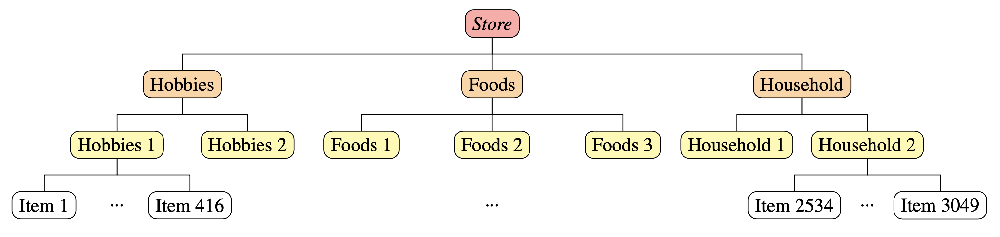

```{r, include = FALSE}
knitr::opts_chunk$set(
  collapse = TRUE,
  comment = "#>"
)
```

```{r setup}
library(bayesRecon)
```

# Introduction

This vignette partially reproduces the results of *Probabilistic reconciliation of mixed-type hierarchical time series* [@zambon2024mixed], 
published at UAI 2024 (the 40th Conference on Uncertainty in Artificial Intelligence).

In particular, we replicate the reconciliation of the one-step ahead (h=1) forecasts of one store of the  M5 competition [@MAKRIDAKIS20221325]. 
Sect. 5 of the paper presents the results for 10  stores, each reconciled
14 times using rolling one-step ahead forecasts. 


# Data and base forecasts

The M5 competition [@MAKRIDAKIS20221325] is about daily time series of sales data referring to 10 different stores. 
Each store has the same hierarchy: 3049 bottom time series (single items) and 11 upper time series,  obtained by aggregating the items by department, product category, and store; see the figure below.

```{r out.width = '100%', echo = FALSE}

```

We reproduce  the results of the store "CA_1". The  base forecasts (for h=1)  of the bottom and upper time series are stored in `M5_CA1_basefc`, available as data in the package.
The base forecast are computed  using ADAM [@svetunkov2023iets], implemented in the R package smooth [@smooth_pkg]. 


```{r}
# Hierarchy composed by 3060 time series: 3049 bottom and 11 upper
n_b <- 3049
n_u <- 11
n <- n_b + n_u   

# Load matrix A 
A <- M5_CA1_basefc$A

# Load base forecasts:
base_fc_upper  <- M5_CA1_basefc$upper
base_fc_bottom <- M5_CA1_basefc$bottom

# We will save all the results in the list rec_fc
rec_fc <- list(
            Gauss      = list(),
            Mixed_cond = list(),
            TD_cond    = list()
          )
```

# Gaussian reconciliation

We first perform Gaussian reconciliation (`Gauss`, @corani2021probabilistic). 
It assumes  all forecasts to be Gaussian, even though the bottom base forecasts are not Gaussian. 

We assume the upper base forecasts to be a multivariate Gaussian and we estimate their  covariance matrix from the in-sample residuals. We assume also the bottom base forecasts to be independent Gaussians.


```{r}
# Parameters of the upper base forecast distributions
mu_u <- unlist(lapply(base_fc_upper, "[[", "mu"))  # upper means
# Compute the (shrinked) covariance matrix of the residuals
residuals.upper <- lapply(base_fc_upper, "[[", "residuals")
residuals.upper <- t(do.call("rbind", residuals.upper))
Sigma_u <- schaferStrimmer_cov(residuals.upper)$shrink_cov
  
# Parameters of the bottom base forecast distributions
mu_b <- c()
sd_b <- c()
for (fc_b in base_fc_bottom) {
  pmf <- fc_b$pmf
  mu_b <- c(mu_b, PMF.get_mean(pmf))
  sd_b <- c(sd_b, PMF.get_var(pmf)**0.5)
}
Sigma_b <- diag(sd_b**2)

# Mean and covariance matrix of the base forecasts
base_forecasts.mu <- c(mu_u,mu_b)
base_forecasts.Sigma <- matrix(0, nrow = n, ncol = n)
base_forecasts.Sigma[1:n_u,1:n_u] <- Sigma_u
base_forecasts.Sigma[(n_u+1):n,(n_u+1):n] <- Sigma_b
```

We reconcile using the function `reconc_gaussian()`, which takes as input: 

* the summing matrix `A`;
* the means of the  base forecast,  `base_forecasts.mu`; 
* the covariance of the base forecast,  `base_forecasts.Sigma`. 

The function returns the reconciled mean and covariance for the bottom time series. 

```{r}    
# Gaussian reconciliation 
start <- Sys.time()       
gauss <- reconc_gaussian(A, base_forecasts.mu, base_forecasts.Sigma)
stop <- Sys.time()

rec_fc$Gauss <- list(mu_b    = gauss$bottom_reconciled_mean,
                     Sigma_b = gauss$bottom_reconciled_covariance,
                     mu_u    = A %*% gauss$bottom_reconciled_mean,
                     Sigma_u = A %*% gauss$bottom_reconciled_covariance %*% t(A))

Gauss_time <- as.double(round(difftime(stop, start, units = "secs"), 2))
cat("Time taken by Gaussian reconciliation: ", Gauss_time, "s")
```


# Reconciliation with mixed-conditioning 

We now reconcile the forecasts using the mixed-conditioning 
approach of @zambon2024mixed, Sect. 3. 
The algorithm is implemented in the function `reconc_MixCond()`. The function takes as input: 

* the aggregation matrix `A`;
* the probability mass functions of the bottom base forecasts, stored in the list `fc_bottom_4rec`;
* the parameters of the multivariate Gaussian distribution for the upper variables, `fc_upper_4rec`;
* additional function parameters; among those note that `num_samples` specifies the number of samples used in the internal importance sampling (IS) algorithm. 

The function returns the reconciled forecasts in the form of probability mass functions for both the upper and bottom time series. The function parameter `return_type` can be changed to `samples` or `all` to obtain the IS samples. 

```{r}
seed <- 1
N_samples_IS <- 5e4

# Base forecasts
fc_upper_4rec <- list(mu=mu_u, Sigma=Sigma_u)
fc_bottom_4rec <- lapply(base_fc_bottom, "[[", "pmf")  # list of PMFs

# MixCond reconciliation
start <- Sys.time()       
mix_cond <- reconc_MixCond(A, fc_bottom_4rec, fc_upper_4rec, bottom_in_type = "pmf",
                          num_samples = N_samples_IS, return_type = "pmf", seed = seed)
stop <- Sys.time()       

rec_fc$Mixed_cond <- list(
  bottom = mix_cond$bottom_reconciled$pmf,
  upper  = mix_cond$upper_reconciled$pmf,
  ESS    = mix_cond$ESS
  )

MixCond_time <- as.double(round(difftime(stop, start, units = "secs"), 2))
cat("Computational time for Mix-cond reconciliation: ", MixCond_time, "s")
```

As discussed in @zambon2024mixed, Sect. 3, conditioning with mixed variables performs poorly in high dimensions.
This is because the bottom-up distribution, built by assuming the bottom forecasts to be independent, is untenable
in high dimensions.
Moreover, forecasts for count time series are usually biased and their sum tends to be strongly biased; see @zambon2024mixed, Fig. 3, for a graphical example. 

# Top down conditioning
Top down conditioning (TD-cond; see @zambon2024mixed, Sect. 4) is a more reliable approach for reconciling  mixed variables in high dimensions.
The algorithm is implemented in the function `reconc_TDcond()`; it takes the same arguments as `reconc_MixCond()` and returns reconciled forecasts in the same format. 

```{r}
N_samples_TD <- 1e4

# TDcond reconciliation
start <- Sys.time()     
td <- reconc_TDcond(A, fc_bottom_4rec, fc_upper_4rec,
                   bottom_in_type = "pmf", num_samples = N_samples_TD, 
                   return_type = "pmf", seed = seed)
stop <- Sys.time()  
```
The algorithm TD-cond raises a warning regarding the incoherence between the joint bottom-up and the upper base forecasts. 
We will see that this warning does not impact the performances of TD-cond.

```{r}
rec_fc$TD_cond <- list(
  bottom = td$bottom_reconciled$pmf,
  upper  = td$upper_reconciled$pmf
  )

TDCond_time <- as.double(round(difftime(stop, start, units = "secs"), 2))
cat("Computational time for TD-cond reconciliation: ", TDCond_time, "s")
```


 
# Comparison

The computational time required for the Gaussian reconciliation is `r Gauss_time` seconds, Mix-cond requires `r MixCond_time` seconds and TD-cond requires `r TDCond_time` seconds. 

For each time series in the hierarchy, we compute the following scores for each method:

- MASE: Mean Absolute Scaled Error

- MIS: Mean Interval Score

- RPS: Ranked Probability Score

```{r}
# Parameters for computing the scores
alpha <- 0.1   # MIS uses 90% coverage intervals
jitt <- 1e-9   # jitter for numerical stability 

# Save actual values
actuals_u <- unlist(lapply(base_fc_upper, "[[", "actual"))
actuals_b <- unlist(lapply(base_fc_bottom, "[[", "actual"))
actuals <- c(actuals_u, actuals_b)

# Scaling factor for computing MASE
Q_u <- M5_CA1_basefc$Q_u
Q_b <- M5_CA1_basefc$Q_b
Q   <- c(Q_u, Q_b)

# Initialize lists to save the results
mase <- list()
mis  <- list()
rps  <- list()
```

The following functions are used for computing the scores:

* `AE_pmf`: compute the absolute error for a PMF;
* `MIS_pmf`: compute interval score for a PMF;
* `RPS_pmf`: compute RPS for a PMF;
* `MIS_gauss`: compute MIS for a Gaussian distribution. 

The implementation of these functions is available in the source code of the vignette but not shown here. 

```{r,include=FALSE}
# Functions for computing the scores of a PMF
AE_pmf <- function(pmf, actual) {
  return(abs(PMF.get_quantile(pmf,p=0.5) - actual))
}
MIS_pmf <- function(pmf, actual, alpha) {
  u <- PMF.get_quantile(pmf, p=1-(alpha/2))
  l <- PMF.get_quantile(pmf, p=alpha/2)
  return(u - l + (2/alpha)*(l - actual)*(actual < l) + 
                 (2/alpha)*(actual - u)*(actual > u) )
}
RPS_pmf <- function(pmf, actual) {
  cdf <- cumsum(pmf) / sum(pmf)
  M <- length(cdf)
  # if actual is outside the supp of pmf, add ones to the end of the cdf:
  if (actual >= M) {  
    cdf <- c(cdf, rep(1, (actual-M+1)))
    M <- length(cdf)
  }
  cdf_act <- (0:(M-1)) >= actual   # unit step function in actual
  crps_ <- sum((cdf - cdf_act)**2)
  return(crps_)
}

# Function for computing the MIS of (possibly truncated) Gaussian forecasts
MIS_gauss <- function(mus, sds, actuals, alpha, trunc=FALSE) {
  z <- qnorm(1-(alpha/2))
  u <- mus + z * sds
  l <- mus - z * sds
  # If it is truncated, set negative quantiles to zero
  if (trunc) {
    l[l<0] <- 0
    u[u<0] <- 0
  }  
  return(u - l + (2/alpha)*(l - actuals)*(actuals < l) + 
                 (2/alpha)*(actuals - u)*(actuals > u) )
}
```


```{r}
# Compute scores for the base forecasts
# Upper
mu_u <- unlist(lapply(base_fc_upper, "[[", "mu"))
sd_u <- unlist(lapply(base_fc_upper, "[[", "sigma"))
mase$base[1:n_u] <- abs(mu_u - actuals_u) / Q_u
mis$base[1:n_u]  <- MIS_gauss(mu_u, sd_u, actuals_u, alpha)
rps$base[1:n_u]  <- scoringRules::crps(actuals_u, "norm", mean=mu_u, sd=sd_u)
# Bottom
pmfs = lapply(base_fc_bottom, "[[", "pmf")
mase$base[(n_u+1):n] <- mapply(AE_pmf, pmfs, actuals_b) / Q_b
mis$base[(n_u+1):n]  <- mapply(MIS_pmf, pmfs, actuals_b, MoreArgs = list(alpha=alpha))
rps$base[(n_u+1):n]  <- mapply(RPS_pmf, pmfs, actuals_b)

# Compute scores for Gauss reconciliation
mu <- c(rec_fc$Gauss$mu_u, rec_fc$Gauss$mu_b)
sd <- c(diag(rec_fc$Gauss$Sigma_u), diag(rec_fc$Gauss$Sigma_b))**0.5
sd <- sd + jitt
mase$Gauss <- abs(mu - actuals) / Q
mis$Gauss <- MIS_gauss(mu, sd, actuals, alpha)
rps$Gauss <- scoringRules::crps(actuals, "norm", mean=mu, sd=sd)

# Compute scores for Mix-cond reconciliation
pmfs <- c(rec_fc$Mixed_cond$upper, rec_fc$Mixed_cond$bottom)
mase$MixCond <- mapply(AE_pmf, pmfs, actuals) / Q
mis$MixCond  <- mapply(MIS_pmf, pmfs, actuals, MoreArgs = list(alpha=alpha))
rps$MixCond  <- mapply(RPS_pmf, pmfs, actuals)

# Compute scores for TD-cond reconciliation
pmfs <- c(rec_fc$TD_cond$upper, rec_fc$TD_cond$bottom)
mase$TDcond <- mapply(AE_pmf, pmfs, actuals) / Q
mis$TDcond  <- mapply(MIS_pmf, pmfs, actuals, MoreArgs = list(alpha=alpha))
rps$TDcond  <- mapply(RPS_pmf, pmfs, actuals)
```


## Skill scores
We report the improvement over the base forecasts using the skill score values and averaging them across experiments.
For instance, the skill score of Gauss on RPS is:

$$ \text{Skill}_{\%}\,(\text{RPS, }Gauss) = 100 \cdot
\frac{\text{RPS}(base) - \text{RPS}(Gauss)}
{(\text{RPS}(base) + \text{RPS}(Gauss))/2}$$

This formula is implemented in the function `skill.score`, available in the source code of the vignette but not shown here.

```{r,include=FALSE}
# Function for computing the skill score
skill.score <- function(ref, met) {
  s <- (2 * (ref - met) / (ref + met)) * 100
  s[is.na(s)] <- 0  # if both numerator and denominator are 0, set skill score to 0
  return(s)
}
```


```{r}
scores <- list(
        mase = mase,
        mis  = mis,
        rps = rps
      )
scores_ = names(scores)

ref_met  <- "base"
methods_ <- c("Gauss", "MixCond", "TDcond")

# For each score and method we compute the skill score with respect to the base forecasts
skill_scores <- list()
for (s in scores_) {
  skill_scores[[s]] <- list()
  for (met in methods_) {
    skill_scores[[s]][["upper"]][[met]] <- skill.score(scores[[s]][[ref_met]][1:n_u], 
                                                       scores[[s]][[met]][1:n_u])
    skill_scores[[s]][["bottom"]][[met]] <- skill.score(scores[[s]][[ref_met]][(n_u+1):n], 
                                                        scores[[s]][[met]][(n_u+1):n])
    }
}
```

We report in the tables below the mean values for each skill score. 


```{r}
mean_skill_scores <- list()

for (s in scores_) {
  mean_skill_scores[[s]] <- rbind(data.frame(lapply(skill_scores[[s]][["upper"]], mean)),
                                    data.frame(lapply(skill_scores[[s]][["bottom"]], mean))
                                     )
  rownames(mean_skill_scores[[s]]) <- c("upper","bottom")
}
```

```{r}
knitr::kable(mean_skill_scores$mase,digits = 2,caption = "Mean skill score on MASE.",align = 'lccc')
```
The mean MASE skill score is positive only for the TD-cond reconciliation. Both Mix-cond and Gauss achieve scores lower than the base forecasts, even if Mix-cond degrades less the base forecasts compared to Gauss. 

```{r}
knitr::kable(mean_skill_scores$mis,digits = 2,caption = "Mean skill score on MIS.")
```
The mean MIS score of TD-cond is slightly above that of the base forecasts. Mix-cond achieves slightly higher scores than the base forecasts only on the bottom variables. Gauss strongly degrades the base forecasts according to this metric.

```{r}
knitr::kable(mean_skill_scores$rps,digits = 2,caption = "Mean skill score on RPS.")
```
The mean RPS skill score for TD-cond is positive for both upper and bottom time series. Mix-cond slightly improves the base forecasts on the bottom variables, however it degrades the upper base forecasts. Gauss strongly degrades both upper and bottom base forecasts. 

## Boxplots

Finally, we show the boxplots of the skill scores for each method divided in upper and bottom levels. 

```{r,fig.width=7,fig.height=8}
custom_colors <- c("#a8a8e4", 
                  "#a9c7e4",
                  "#aae4df")

# Boxplots of MASE skill scores
par(mfrow = c(2, 1))
boxplot(skill_scores$mase$upper, main = "MASE upper time series", 
        col = custom_colors, ylim = c(-80,80))
abline(h=0,lty=3)
boxplot(skill_scores$mase$bottom, main = "MASE bottom time series", 
        col = custom_colors, ylim = c(-200,200))
abline(h=0,lty=3)
```
```{r,eval=TRUE,include=FALSE}
par(mfrow = c(1, 1))
```

Both Mix-cond and TD-cond do not improve the bottom MASE over the base forecasts (boxplot flattened on the value zero), however TD-cond provides a slight improvement over the upper base forecasts (boxplot over the zero line).

```{r,fig.width=7,fig.height=8}
# Boxplots of MIS skill scores
par(mfrow = c(2, 1))
boxplot(skill_scores$mis$upper, main = "MIS upper time series", 
        col = custom_colors, ylim = c(-150,150))
abline(h=0,lty=3)
boxplot(skill_scores$mis$bottom, main = "MIS bottom time series", 
        col = custom_colors, ylim = c(-200,200))
abline(h=0,lty=3)
```
```{r,eval=TRUE,include=FALSE}
par(mfrow = c(1, 1))
```

Both Mix-cond and TD-cond do not improve nor degrade the bottom base forecasts in MIS score as shown by the small boxplots centered around zero. On the upper variables instead only TD-cond does not degrade the MIS score of the base forecasts. 


```{r,fig.width=7,fig.height=8}
# Boxplots of RPS skill scores
par(mfrow = c(2,1))
boxplot(skill_scores$rps$upper, main = "RPS upper time series", 
        col = custom_colors, ylim = c(-80,80))
abline(h=0,lty=3)
boxplot(skill_scores$rps$bottom, main = "RPS bottom time series", 
        col = custom_colors, ylim = c(-200,200))
abline(h=0,lty=3)
```
```{r,eval=TRUE,include=FALSE}
par(mfrow = c(1, 1))
```

According to RPS, TD-cond does not degrade the bottom base forecasts and improves the upper base forecasts. On the other hand both Gauss and Mix-cond strongly degrade the upper base forecasts. 


# Full reproducibility

The full experiment described in [@zambon2024mixed] can be reproduced by using the code available [here](https://github.com/LorenzoZambon/M5_MixedReconc).

# References
<div id="refs"></div>
