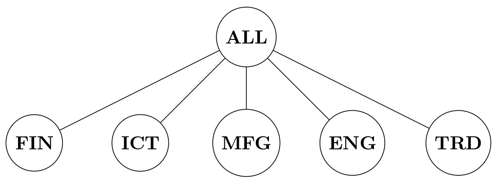

```{r, include = FALSE}
knitr::opts_chunk$set(
  collapse = TRUE,
  comment = "#>"
)
```


# Introduction

This vignette reproduces the results of the paper *Properties of the reconciled distributions for Gaussian and count forecasts* [@zambon2024properties], 
accepted for publication in the International Journal of Forecasting.
We  replicate here the main experiment of the paper (see sec. 3, @zambon2024properties)  where we  reconcile  base forecasts constituted by  negative binomial distributions. 

We use the R package `BayesRecon`.

```{r setup}
library(bayesRecon)
```

# Data and base forecasts

We release a new data set, containing time series of counts of extreme market events 
in five economic sectors in the period 2005-2018 (3508 trading days). 
The counts are computed by considering 29 companies included in the Euro Stoxx 50 index 
and observing if the value of the CDS spread on a given day exceeds the 90-th percentile of its distribution in the last trading year.
The companies are divided into the following  sectors: Financial (FIN), Information and Communication Technology (ICT), 
Manufacturing (MFG), Energy (ENG), and Trade (TRD). 

The hierarchy is composed of 5 bottom time series, the daily number of extreme market  
events in each sector, and 1 upper time series (the sum of the different sectors). 
Data are stored in `extr_mkt_events`.

```{r finTShier, fig.cap="**Figure 1**: financial time series hierarchy.", out.width = '80%', echo = FALSE}

```

We also make available as `extr_mkt_events_basefc` the base forecasts to be reconciled. 
As discussed in the paper, they are  produced
using the model by [@agosto2022multivariate];
the predictive distributions
are  negative binomial. 

```{r}
# Hierarchy composed by 6 time series: 5 bottom and 1 upper
n_b <- 5
n_u <- 1
n <- n_b + n_u   

A <- matrix(1, ncol = n_b, nrow = n_u)  # aggregation matrix

# Actual values:
actuals <- data.frame(extr_mkt_events)  # convert to data frame
# Base forecasts:
base_fc <- extr_mkt_events_basefc

N <- nrow(actuals)  # number of days (3508)

# # If you want to run only N reconciliations (instead of 3508):
# N <- 200
# actuals <- actuals[1:N,]
# base_fc$mu <- base_fc$mu[1:N,]
```

# Reconciliation via conditioning

We reconcile the base forecasts via conditioning, using importance sampling.
We use the `reconc_BUIS` function, which implements the BUIS algorithm [@zambon2022efficient];
since there is only one upper time series in the hierarchy, the BUIS algorithm is
equivalent to importance sampling.
We perform 3508 reconciliations, one for each day, drawing each time 10,000 samples from the reconciled distribution.
We use 10,000 samples instead of 100,000 (as in the paper) to speed up the computation.

For each day, we save the empirical mean, median, and quantiles of the reconciled distribution.

```{r}
# We need to save the mean and median of the reconciled distribution
# in order to compute the squared error and the absolute error:
rec_means   <- matrix(NA, ncol = n, nrow = N)
rec_medians <- matrix(NA, ncol = n, nrow = N)

# We need to save the lower and upper quantiles of the reconciled distribution
# in order to compute the interval score:
rec_L <- matrix(NA, ncol = n, nrow = N)
rec_U <- matrix(NA, ncol = n, nrow = N)
int_cov = 0.9   # use 90% interval         
q1 <- (1 - int_cov) / 2
q2 <- (1 + int_cov) / 2

# Set the number of samples to draw from the reconciled distribution:
N_samples <- 1e4

start <- Sys.time()
for (j in 1:N) {
  # Base forecasts:
  base_fc_j <- c()   
  for (i in 1:n) {
    base_fc_j[[i]] <- list(size = base_fc$size[[i]], mu = base_fc$mu[[j,i]])
  }
  
  # Reconcile via importance sampling:
  buis <- reconc_BUIS(A, base_fc_j, "params", "nbinom", 
                      num_samples = N_samples, seed = 42)
  samples_y <- buis$reconciled_samples
  
  # Save mean, median, and lower and upper quantiles:
  rec_means[j,]   <- rowMeans(samples_y)
  rec_medians[j,] <- apply(samples_y, 1, median)
  rec_L[j,]       <- apply(samples_y, 1, quantile, q1)
  rec_U[j,]       <- apply(samples_y, 1, quantile, q2)
}
stop <- Sys.time()
cat("Computational time for ", N, " reconciliations: ",     
    round(difftime(stop, start, units = "secs"), 2), "s")
```

We compute the median and the quantiles of the negative binomial base forecasts.

```{r}
base_means   <- base_fc$mu
base_medians <- matrix(NA, ncol = n, nrow = N)
base_L       <- matrix(NA, ncol = n, nrow = N)
base_U       <- matrix(NA, ncol = n, nrow = N)

for (i in 1:n) {
  base_medians[,i] <- sapply(base_means[,i], 
                       function(mu) qnbinom(p=0.5, size=base_fc$size[[i]], mu=mu))
  base_L[,i]       <- sapply(base_means[,i], 
                       function(mu) qnbinom(p=q1,  size=base_fc$size[[i]], mu=mu))
  base_U[,i]       <- sapply(base_means[,i], 
                       function(mu) qnbinom(p=q2,  size=base_fc$size[[i]], mu=mu))
}
```

For each day and for each time series, we compute the absolute error, the squared error, 
and the interval score for the base and reconciled forecasts.

```{r}
# Compute the squared errors
SE_base <- (base_means - actuals)^2
SE_rec  <- (rec_means - actuals)^2

# Compute the absolute errors
AE_base <- abs(base_medians - actuals)
AE_rec  <- abs(rec_medians - actuals)

# Define the function for the interval score
int_score <- function(l, u, actual, int_cov = 0.9) {
  is <- (u - l) +
  2 / (1-int_cov) * (actual - u) * (actual>u) +
  2 / (1-int_cov) * (l - actual) * (l>actual) 
  return(is)
}

# Compute the interval scores
IS_base <- mapply(int_score, base_L, base_U, data.matrix(actuals))
IS_base <- matrix(IS_base, nrow = N)
IS_rec <- mapply(int_score, rec_L, rec_U, data.matrix(actuals))
IS_rec <- matrix(IS_rec, nrow = N)
```

We compute and show the skill scores, which measure the improvement of the 
reconciled forecasts over the base forecasts.
The skill score is symmetric and bounded between -2 and 2.

```{r}
SS_AE <- (AE_base - AE_rec) / (AE_base + AE_rec) * 2
SS_SE <- (SE_base - SE_rec) / (SE_base + SE_rec) * 2
SS_IS <- (IS_base - IS_rec) / (IS_base + IS_rec) * 2
SS_AE[is.na(SS_AE)] <- 0
SS_SE[is.na(SS_SE)] <- 0
SS_IS[is.na(SS_IS)] <- 0

mean_skill_scores <- c(round(colMeans(SS_IS), 2),
                       round(colMeans(SS_SE), 2),
                       round(colMeans(SS_AE), 2))
mean_skill_scores <- data.frame(t(matrix(mean_skill_scores, nrow = n)))
colnames(mean_skill_scores) <- names(actuals)
rownames(mean_skill_scores) <- c("Interval score", "Squared error", "Absolute error")
knitr::kable(mean_skill_scores)
```

The table closely matches Table 4 of the paper.
In order to exactly reproduce  the paper table, it is necessary increase the number of samples  drawn from the reconciled distribution to 100,000.

# Reconciled mean and variance

We now show the effects of the reconciliation on the mean and variance of the
forecast distribution. For more details, we refer to Section 3.2 of the paper.

We observe two different behaviors for the reconciled upper mean:
it can be between the base and the bottom-up mean (*combination* effect)
or it can be lower than both (*concordant-shift* effect).
We show them for two different days.

```{r}
# Now we draw a larger number of samples:
N_samples <- 1e5

### Example of concordant-shift effect
j <- 124
base_fc_j <- c()   
for (i in 1:n) base_fc_j[[i]] <- list(size = extr_mkt_events_basefc$size[[i]],
                                      mu = extr_mkt_events_basefc$mu[[j,i]])
# Reconcile
buis <- reconc_BUIS(A, base_fc_j, "params", "nbinom", 
                    num_samples = N_samples, seed = 42)
samples_y <- buis$reconciled_samples

# The reconciled mean is lower than both the base and bottom-up means:
means <- c(round(extr_mkt_events_basefc$mu[[j,1]], 2),
           round(sum(extr_mkt_events_basefc$mu[j,2:n]), 2),
           round(mean(samples_y[1,]), 2))
col_names <- c("Base upper mean", "Bottom-up upper mean", "Reconciled upper mean")
knitr::kable(matrix(means, nrow=1), col.names = col_names)

### Example of combination effect 
j <- 1700
base_fc_j <- c()   
for (i in 1:n) base_fc_j[[i]] <- list(size = extr_mkt_events_basefc$size[[i]],
                                      mu = extr_mkt_events_basefc$mu[[j,i]])
# Reconcile 
buis <- reconc_BUIS(A, base_fc_j, "params", "nbinom", 
                    num_samples = N_samples, seed = 42)
samples_y <- buis$reconciled_samples

# The reconciled mean is between the base and the bottom-up mean:
means <- c(round(extr_mkt_events_basefc$mu[[j,1]], 2),
           round(sum(extr_mkt_events_basefc$mu[j,2:n]), 2),
           round(mean(samples_y[1,]), 2))
col_names <- c("Base upper mean", "Bottom-up upper mean", "Reconciled upper mean")
knitr::kable(matrix(means, nrow=1), col.names = col_names)
```

Finally, we show an example in which the variance of the bottom time series increases
after reconciliation. 
This is a major difference with the Gaussian reconciliation, for which the reconciled 
variance is always smaller than the base variance.

```{r}
j <- 2308
base_fc_j <- c()   
for (i in 1:n) base_fc_j[[i]] <- list(size = extr_mkt_events_basefc$size[[i]],
                                      mu = extr_mkt_events_basefc$mu[[j,i]])
# Reconcile
buis <- reconc_BUIS(A, base_fc_j, "params", "nbinom", num_samples = N_samples, seed = 42)
samples_y <- buis$reconciled_samples

# Compute the variance of the base and reconciled bottom forecasts
base_bottom_var <- mapply(function(mu, size) var(rnbinom(n = 1e5, size = size, mu = mu)),
                          extr_mkt_events_basefc$mu[j,2:n], 
                          extr_mkt_events_basefc$size[2:n])
rec_bottom_var <- apply(samples_y[2:n,], MARGIN = 1, var) 

# The reconciled variance is greater than the base variance:
bottom_var <- rbind(base_bottom_var, rec_bottom_var)
rownames(bottom_var) <- c("var base", "var reconc")
knitr::kable(round(bottom_var, 2))
```

# References
<div id="refs"></div>

